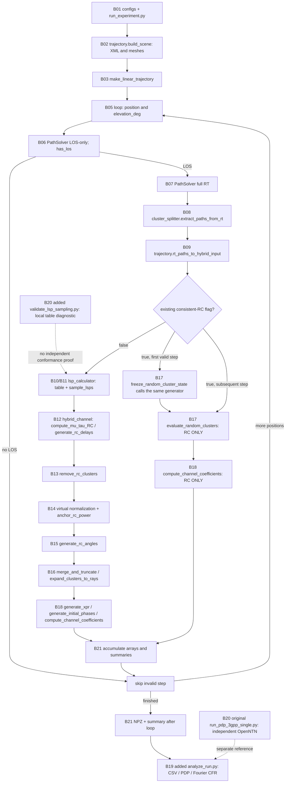
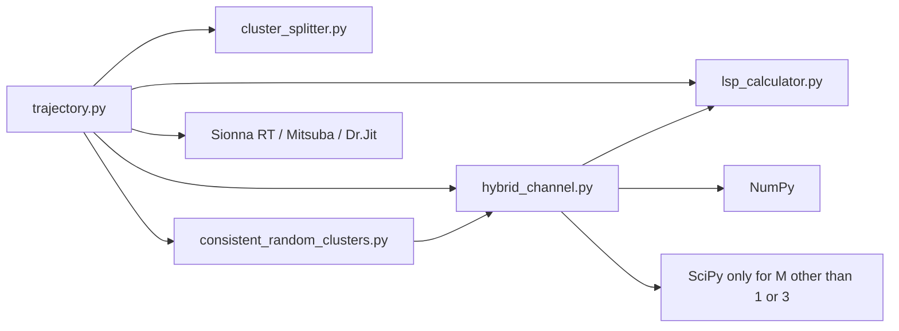

# Actual execution flow

The two supplied images describe a target architecture. This graph shows only the inspected selected code; dashed reference relationships are not an implemented per-step API.

`B04` (general RT/RC/Hybrid selector) has no matching implementation. TLE/ephemeris in B03, complete RT identity tracking in B17 and automatic per-step OpenNTN LSP validation in B20 are not implemented in this path. Saving happens after the loop, not after each position as drawn in the process diagram. The new wrapper and analysis are labeled additions, not prior research methods.

