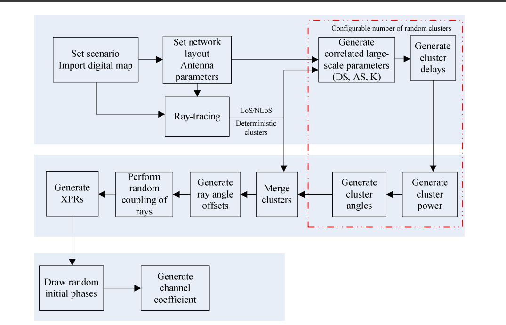

# Hybrid RT–RC Satellite Channel Simulator

This repository implements a satellite-to-ground channel model combining Sionna ray tracing (RT) with statistical random clusters (RC). The hybrid channel generation methodology is based on the map-based hybrid model in **3GPP TR 38.901 (v19), Clause 8**.

RT paths describe the scene-specific propagation environment. Random clusters supplement these paths through delay generation, duplicate-cluster removal, and power anchoring. The combined rays form a complex MIMO channel impulse response along a configurable straight satellite trajectory.

## Channel Generation Procedure



Source: **3GPP TR 38.901 V19.1.0 (Release 19), Clause 8.4, Figure 8.4-1**, “Channel coefficient generation procedure.” [ETSI reference](https://www.etsi.org/deliver/etsi_TR/138900_138999/138901/19.01.00_60/tr_138901v190100p.pdf#page=151). The figure shows the reference methodology; [model notes](docs/model.md) describe this implementation.

## Files

```text
run_simulation.py       Run a simulation from a configuration file
plot_results.py         Plot PDP/CFR and export CSV metrics
Hybrid_channel/        Channel generation and trajectory modules
Config/                Example, NYC Hybrid, and consistent-RC settings
docs/                  Flowchart, model notes, and dependency notices
requirements.txt       Fixed dependency versions
install.sh             Linux virtual-environment setup
check_installation.py  Environment and small-example checks
```

## Installation

The original research environment recorded in the handoff is Ubuntu 24.04, Python 3.12, Sionna RT 1.2.1, and an NVIDIA RTX 5080. A fresh installation of this repository has not yet been validated end to end. Other platforms have not been verified for RT execution.

Install Git, Python 3.12 with `venv` support, and a working NVIDIA driver before starting. Check GPU visibility with `nvidia-smi`. Sionna RT also has an LLVM CPU backend; its use with this project has not been validated. See the [Sionna RT installation guide](https://nvlabs.github.io/sionna/rt/installation.html) for backend prerequisites, using the pinned versions below rather than upgrading to the latest release.

```bash
git clone https://github.com/Ollie-92/HybridChannel.git
cd HybridChannel
bash install.sh
source .venv/bin/activate
python check_installation.py --run-example
```

`install.sh` creates a local `.venv`, installs the versions in `requirements.txt`, and checks dependencies and backend selection. It does not install system packages or GPU drivers. The repository is private, so cloning requires access to it.

The example check runs all three positions, rejects missing steps, invalid array dimensions, non-finite values, negative delays, or empty channels, then generates plots and CSV metrics. Successful execution ends with `Example check passed:` and the output directory. This is an execution check, not a comparison against published numerical results.

For a manual installation, run `python3.12 -m venv .venv`, activate it, and run `python -m pip install -r requirements.txt`. Then run the same example check above.

If installation fails, check the Python version and the first dependency error. If backend initialization fails, check the driver or LLVM setup. If simulation fails, inspect `run.log` in the printed `RUN_DIR`. Each run records its package versions, configuration, code revision, and scene hashes. Keep these records when comparing results; a fixed seed alone does not guarantee identical results on different hardware. A numerical baseline and cross-machine tolerances have not yet been established.

## Usage

Run commands from the repository root.

### Basic example

```bash
python run_simulation.py --config Config/example.json
```

This example generates a small ground-plane scene and evaluates three satellite positions. No external scene is required.

### NYC scene

The NYC scene XML and its referenced meshes are included in this private repository:

```text
Scene/NYC_scene/
    NYC_sionna.xml
    meshes/
```

The scene contains one XML file and 2,905 mesh files (about 94 MB in total). Blender project files and other scenes are not included. Public redistribution permission for these assets has not been established.

```bash
# Hybrid RT + RC
python run_simulation.py --config Config/nyc_hybrid.json

# Fixed-scatterer RC-only
python run_simulation.py --config Config/nyc_consistent_rc.json
```

Edit the `cli` fields in `Config/` to change carrier frequency, antenna count, receiver coordinates, trajectory, seed, or RT settings. The NYC configurations use 28 GHz, 600 km scene altitude, and five positions over 0.2 seconds.

For another scene, add `--scene /absolute/path/to/scene.xml` and adjust receiver coordinates and trajectory settings for that scene.

### Results

Each simulation prints a new directory under `Result/`, containing channel coefficients, delays, satellite positions, configuration, and logs. Use that directory to generate PDP/CFR plots and CSV metrics:

```bash
python plot_results.py Result/<run-directory> --trusted-local-output
```

Only analyze trusted simulation files. Analysis reads NumPy object arrays and saves its outputs under the run's `analysis/` directory.

## Model Notes

The consistent-RC option retains fixed scatterers and outputs an RC-only channel. Full Hybrid temporal consistency and TLE propagation are not implemented. Hybrid delays are excess delays; consistent-RC delays are absolute delays. Equations, units, and the retained NTN parameter approximations are documented in [docs/model.md](docs/model.md).

Original numerical comparisons and development tests are preserved on the [archive/research-validation branch](https://github.com/Ollie-92/HybridChannel/tree/archive/research-validation). Its instructions apply to that branch's layout. Independent 3GPP/OpenNTN conformance has not been established.

## References

- 3GPP TR 38.901 V19.1.0, *Study on channel model for frequencies from 0.5 to 100 GHz*, Release 19, October 2025. [ETSI PDF](https://www.etsi.org/deliver/etsi_TR/138900_138999/138901/19.01.00_60/tr_138901v190100p.pdf).
- [Sionna RT](https://github.com/NVlabs/sionna-rt), ray-tracing library.

### OpenNTN

T. Düe, M. Vakilifard, C. Bockelmann, D. Wübben, and A. Dekorsy, “OpenNTN: An Open-Source Framework for Non-Terrestrial Network Channel Simulations,” *International Workshop on Smart Antennas (WSA)*, Erlangen, Germany, September 16–18, 2025. [Paper](https://www.ant.uni-bremen.de/sixcms/media.php/102/15183/OpenNTN_An_OpenSource_Framework_For_NTN_Simulations.pdf) · [Code](https://github.com/ant-uni-bremen/OpenNTN).

<details>
<summary>BibTeX</summary>

```bibtex
@inproceedings{OpenNTNPaper,
  author    = {T. D{\"u}e and M. Vakilifard and C. Bockelmann and D. W{\"u}bben and A. Dekorsy},
  title     = {{OpenNTN}: An Open-Source Framework for Non-Terrestrial Network Channel Simulations},
  booktitle = {International Workshop on Smart Antennas (WSA)},
  address   = {Erlangen, Germany},
  year      = {2025},
  month     = sep,
  url       = {https://www.ant.uni-bremen.de/sixcms/media.php/102/15183/OpenNTN_An_OpenSource_Framework_For_NTN_Simulations.pdf}
}
```

</details>

Third-party licenses and notices are listed in [docs/third_party](docs/third_party/README.md).
